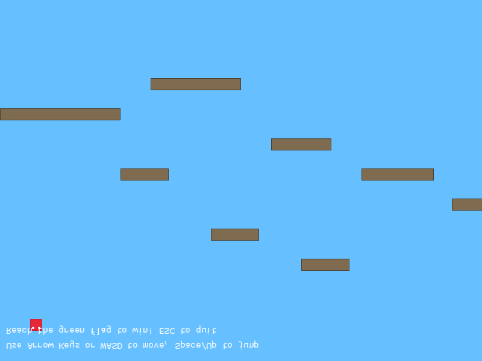

# Rust Mario

A simple Mario-like platformer game built with Rust and the macroquad library.

## Screenshot



## Features

- **Controllable Player**: Move and jump with a red square character representing Mario
- **Platforms**: Navigate through various platforms with realistic physics
- **Goal System**: Reach the green flag to win the level
- **Camera Follow**: Smooth camera that follows the player
- **Physics**: Gravity, jumping, and collision detection
- **Screenshot Capture**: Generate screenshots of the game for documentation

## Controls

- **Movement**: Arrow keys or WASD
- **Jump**: Space bar or Up arrow
- **Quit**: ESC key

## How to Run

Make sure you have Rust installed on your system. If not, install it from [rustup.rs](https://rustup.rs/).

1. Clone the repository:
   ```bash
   git clone https://github.com/ravikirankalal/rust-mario.git
   cd rust-mario
   ```

2. Run the game:
   ```bash
   cargo run
   ```

   The game will compile and open a window with the Mario level.

## Screenshot Generation

You can generate a screenshot of the game using the included screenshot generator:

```bash
cargo run --bin generate_screenshot
```

This will create a screenshot at `assets/screenshot.png` showing the initial game state. The screenshot generator uses macroquad's screen capture functionality to save a PNG image of the rendered game.

The screenshot feature is implemented using:
- `get_screen_data()` to capture the current screen
- `Image` creation and PNG export using the `image` crate
- Non-interactive screenshot generation for automated documentation

## Game Instructions

- Use the arrow keys or WASD to move left and right
- Press Space or Up arrow to jump
- Navigate through the platforms to reach the green flag on the right
- If you fall off the screen, you'll respawn at the starting position
- Reach the goal flag to win!

## Architecture

The game is structured into several key components:

- `src/main.rs`: Entry point that initializes the game window and runs the level
- `src/simple_level.rs`: Contains the main game logic including:
  - `Player`: Handles player movement, physics, and input
  - `Platform`: Represents solid platforms for collision detection
  - `Goal`: The target flag that the player needs to reach
  - `SimpleLevel`: Main game state and rendering logic
- `src/screenshot.rs`: Screenshot capture functionality using macroquad's screen data
- `src/bin/generate_screenshot.rs`: Standalone utility to generate game screenshots

## Future Enhancements

The code is designed to be easily extendable. Potential future features include:

- **Enemies**: Add moving enemies with AI patterns
- **Coins**: Collectible items for scoring
- **Power-ups**: Items that enhance player abilities
- **Multiple Levels**: Different level layouts and challenges
- **Sound Effects**: Audio feedback for actions
- **Sprites**: Replace simple shapes with detailed graphics
- **Background**: Add parallax scrolling backgrounds

## Dependencies

- **macroquad 0.4**: Cross-platform game engine for 2D graphics and input handling
- **image 0.24**: Image processing library for PNG export functionality

## License

This project is licensed under the GNU General Public License v3.0 - see the [LICENSE](LICENSE) file for details.